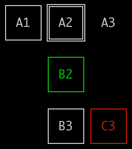

# coordinate-grid

[](https://gitspo.com/mentions/gajus/coordinate-grid)
[](https://travis-ci.org/gajus/coordinate-grid)
[](https://coveralls.io/github/gajus/coordinate-grid)
[](https://www.npmjs.org/package/coordinate-grid)
[](https://github.com/gajus/canonical)
[](https://twitter.com/kuizinas)

Generates a coordinate grid (CLI square grid).

## Usage

```js
import {
  createCoordinateSquare,
  drawCoordinateGrid,
  drawSquare,
} from 'coordinate-grid';

/**
 * @param {string} name
 * @param {number} style Square style (possible values: 'single', 'double', 'borderless') (default value: 'single').
 * @param {number} color Square color (possible value: 'red', 'green', 'yellow', 'blue') (default: none).
 * @return {string}
 */
drawSquare(name, style, color);

/**
 * Creates an instruction for a single square in a coordinate grid.
 *
 * @param {number} x Horizontal coordinate.
 * @param {number} y Vertical coordinate.
 * @param {string} body
 * @returns {CoordinateSquare}
 */
createCoordinateGridMember(x, y, body);

/**
 * Produces a text representation of a collection of coordinate squares placed on a coordinate grid.
 *
 * @param {CoordinateSquare[]} coordinateSquares
 * @param {string} emptySquare Filler text for missing coordinate members.
 * @returns {string}
 */
drawCoordinateGrid(coordinateSquares, emptySquare)

```


## Example

### Using single character

```js
import {
  createCoordinateSquare,
  drawCoordinateGrid,
} from 'coordinate-grid';

console.log(
  drawCoordinateGrid([
    createCoordinateGridMember(0, 0, 'x'),
    createCoordinateGridMember(1, 0, 'x'),
    createCoordinateGridMember(2, 0, 'x'),
    createCoordinateGridMember(1, 1, 'x'),
    createCoordinateGridMember(1, 2, 'x'),
    createCoordinateGridMember(2, 2, 'x')
  ], '_')
);

```

Produces:

```
xxx
_x_
_xx

```

### Using ASCII boxes

```js
import {
  createCoordinateSquare,
  drawCoordinateGrid,
  drawSquare,
} from 'coordinate-grid';

console.log(
  drawCoordinateGrid([
    createCoordinateGridMember(0, 0, drawSquare('A1')),
    createCoordinateGridMember(1, 0, drawSquare('A2', 'double')),
    createCoordinateGridMember(2, 0, drawSquare('A3', 'borderless')),
    createCoordinateGridMember(1, 1, drawSquare('B2', 'single', 'green')),
    createCoordinateGridMember(1, 2, drawSquare('B3')),
    createCoordinateGridMember(2, 2, drawSquare('C3', 'single', 'red'))
  ])
);

```

Produces:

```
┌────┐╔════╗
│ A1 │║ A2 ║  A3
└────┘╚════╝
      ┌────┐
      │ B2 │
      └────┘
      ┌────┐┌────┐
      │ B3 ││ C3 │
      └────┘└────┘

```

Which when rendered in terminal looks like this:


